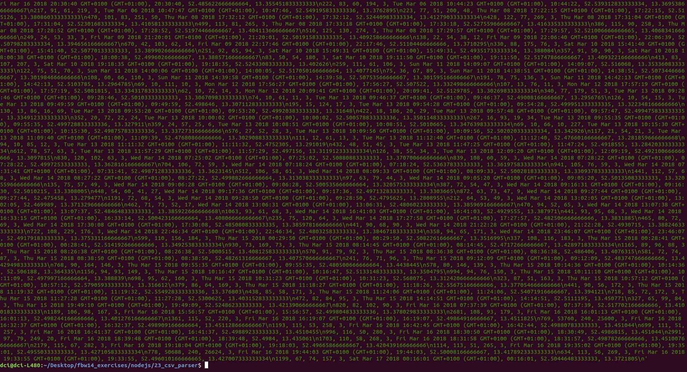

# CSV Parser #

### project started on 2019-10-21 and finished on 2019-10-22 ###

This is a project, which reads the database and write the data into a csv file. 

#### To make it run, you have to install seperate things: ####

first you have to install nmp:

+ ` npm install -y ` 

then you have to do:

+ ` npm init `

after that you have to install mongoose:

+ ` npm -i mongoose --save `

and to start the database:

+ ` mongod `

and the output will look as following:

